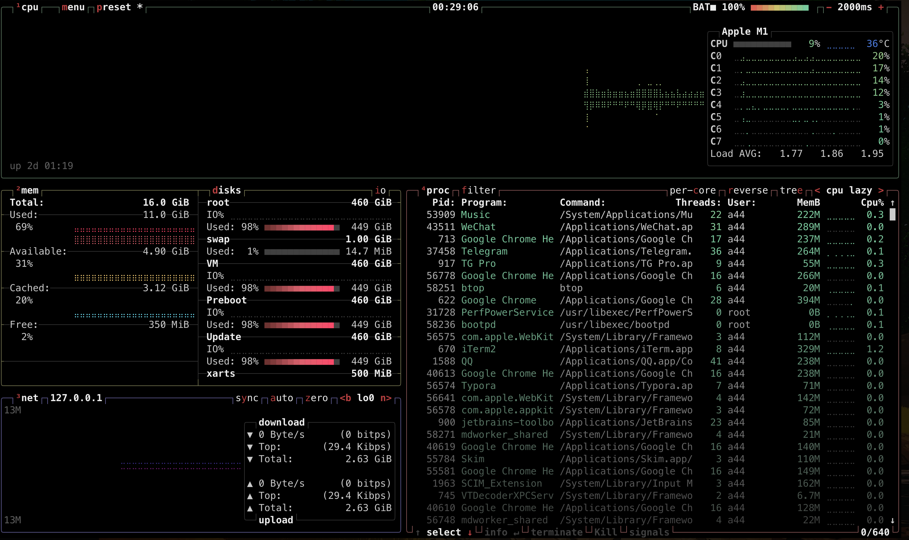
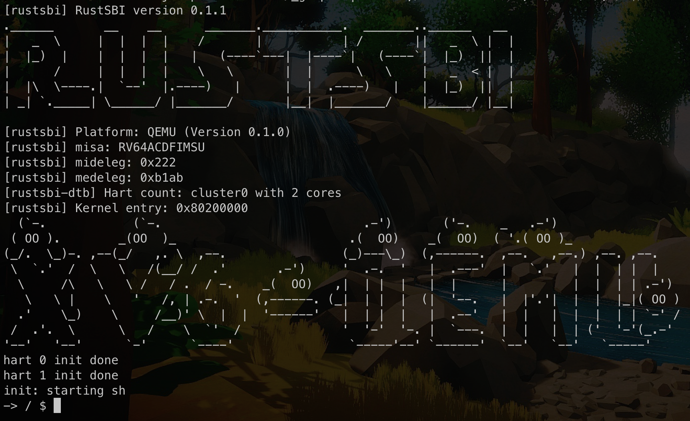

# A process viewer for xv6

[中文版](README_zh.md)

## Introduction

Who doesn't like staring at `top(1)` all day, pretending you're a cool hacker? If you don't know `top`, it provides an ongoing look at processor activity in real time, and can provide an interactive interface for manipulating processes. There are many top variants out there, and I think [htop](https://github.com/htop-dev/htop) and [btop](https://github.com/aristocratos/btop) are cool! Definitely try them at home.



To make things cooler, we'll write our own `top`, from scratch, on our own operating system. A cool difference between implementing a `top` in Linux and our own OS, is that we don't get [nice processes information APIs](https://man7.org/linux/man-pages/man5/proc.5.html) for free, we need to get our hands dirty to implement them.

> Narrator: Wait, what do you mean by API? 🤔

Oh, oh, it's an acronym for [Application Programming Interface](https://en.wikipedia.org/wiki/API), which "is a software layer that allows two applications to talk to each other". In the context of operating system, API is how you talk to the kernel. For example, in `top`, we might ask the kernel what the pid (processes have IDs, if you don't remember) of current process is, by invoking syscall [`getpid()`](https://man7.org/linux/man-pages/man2/getpid.2.html).

Luckily, we'll base our work on the de facto OS for teaching and learning - [xv6](https://pdos.csail.mit.edu/6.828/2018/xv6/book-rev11.pdf), which already has `getpid()`.

> Narrator: But I want to write an OS from scratch, you know... to have maximum fun?

Of course! You're encouraged to write [your](https://rcore-os.github.io/rCore-Tutorial-Book-v3/index.html) [own](https://nankai.gitbook.io/ucore-os-on-risc-v64/) [OS](https://xiayingp.gitbook.io/build_a_os/), if you have infinite amount of time. But to save some time, we'll stick to xv6. Nonetheless, to implement `top`, there's still a lot of APIs we need to add upon xv6.

To make things even cooler, we will run our `top` on real hardware, a nice and shiny [K210](https://canaan.io/product/kendryteai) board that is built on the [RISC-V](https://en.wikipedia.org/wiki/RISC-V) architecture.

> Narrator: What, what is RISC-V?

Oh, just like [ARM](https://en.wikipedia.org/wiki/ARM_architecture_family) is a simpler version of x86, RISC-V is a much simpler version of ARM. And most importantly, it's the architecture that *everybody loves*.

> Narrator: I don't love it.

...which is fine, it's fine because you won't need to know RISC-V, because [people](https://github.com/HUST-OS/xv6-k210/graphs/contributors) at [HUST](https://www.hust.edu.cn/) has already done the hard work for us. Introducing the amazing `xv6-k210` project, which ports xv6 to K210 board.

Without further ado, let's have some fun.

Remember we said we want to implement `top`? Well, it's interactive, and to make you focused on the OS part, instead of the cool UI, we'll first implement a less cool version of `top` - `ps`, that just prints all processes' state as table and exits. Let's try that in real Linux!

```
$ ps
    PID TTY          TIME CMD
   5303 pts/0    00:00:00 zsh
   5380 pts/0    00:00:00 ps
```

which only prints out only two processes, the `zsh` shell I'm using and the `ps` itself. Wait, it doesn't make sense...

> Narrator: to implement `ps` if we can only have 2 processes running at the same time. You know for sure it's gonna print these two, right?

Exactly! Before we implement `ps`, we'll enable the xv6 shell to run multiple processes at the same time, and we'll achieve it by supporting `&`. The magic symbol you can add after a command, to make it run in the background:

```bash
$ sleep 10 &  # Sleep for 10 seconds, in the background
[1] 5490
$ ps
    PID TTY          TIME CMD
   5303 pts/0    00:00:00 zsh
   5490 pts/0    00:00:00 sleep
   5496 pts/0    00:00:00 ps
$ echo Heh Heh # Do other things while sleeping
Heh Heh
$
[1]  + done       sleep 10
$
```

Assume in an alternative universe, we have added this feature to xv6.

> Narrator: Hello from another universe! I'm happy to tell you that xv6 already has [background execution](https://github.com/HUST-OS/xv6-k210/blob/main/xv6-user/sh.c#L392-L402).

Hello! Hello? Wait, what? I don't believe you, and wait for me to try out myself.

```
# in the xv6-k210 directory
$ make run platform=qemu
...
-> / $ sleep 100 &       # finishes immediately
-> / $ echo do something else while sleeping
do something else while sleeping
-> / $ 
```

Oh... I see that xv6 is really a surprising piece of treasure.

Anyways, so we don't get to implement background execution itself, but we can *improve* it. As you can see, we can't interrupt a running `sleep` process by pressing `Ctrl+C`. 

> Narrator: Let's make `Ctrl+C` terminate the foreground process!

Let's not limit ourselves to just termination, but to give the user program freedom to do anything when it receives a signal, by executing its *signal handler*.

The next step would be retrieving processes' information from the kernel. We could use the syscall interface, but instead we will closely follow actual Linux implementation, and use filesystem to communicate between the kernel and our `ps`.

The filesystem in question is called the [proc filesystem](https://man7.org/linux/man-pages/man5/proc.5.html), which "is a pseudo-filesystem which provides an interface to kernel data structures. It's commonly mounted at `/proc`", that provides process information. Example:

```bash
$ sleep 1337 &
[1] 5690
$ ps
    PID TTY          TIME CMD
   5303 pts/0    00:00:01 zsh
   5690 pts/0    00:00:00 sleep
   5832 pts/0    00:00:00 ps
$ echo The pid is 5569, Let\'s check it out in /proc
The pid is 5569, Let's check it out in /proc
$ ls -l /proc | grep 5690
dr-xr-xr-x  9 ubuntu           ubuntu                         0 Jun 21 10:13 5690
$ cat /proc/5690/stat
5690 (sleep) S 5303 5690 5303 34816 5769 1077936128 143 0 0 0 0 0 0 0 25 5 1 0 12929348 6823936 116 18446744073709551615 187650721452032 187650721479328 281474017591088 0 0 0 0 0 0 1 0 0 17 0 0 0 0 0 0 187650721544968 187650721546472 187650724663296 281474017594807 281474017594818 281474017594818 281474017595369 0
```

Let's walk through it.

1. We spawn a sleep process, ask it to run in the background.
2. `ps` shows it is indeed running, and its pid is 5690.
3. under the `/proc` directory, there's a directory named `5690`, containing the process information of `sleep`.
4. in `/proc/5690/stat` file, stores the status information about the process.
5. looking up the `/proc/[pid]/stat` section of the [man page](https://man7.org/linux/man-pages/man5/proc.5.html), we see the first number represents the process ID, which is, of course, 5690.
6. the second field contains the filename of the executable, wrapped in parentheses.
7. the third field is the process state, where `S` stands for sleeping.
8. the fourth field is the PID of the parent of this process, which is the `zsh` shell, that has a PID of 5303.
9. ... check out STANDARD FORMAT SPECIFIERS section of `man ps` in your free time

And now, we can make `ps` out of `/proc`. 

> Narrator: Oh no, isn't `/proc` a little bit too hard?

Emm, okay, then we'll start with syscall interface first, and work our way to implement `/proc`!

## Task 0: Getting Started

1. Fork [xv6-k210](https://github.com/abrasumente233/xv6-k210) on GitHub
2. Launch your favorite Linux environment: [WSL2](https://docs.microsoft.com/en-us/windows/wsl/install), VirtualBox or a real Linux box (NOTE: WSL1 won't work because it doesn't support `mount` and usb devices)
3. Open a terminal
4. If you're on Ubuntu, run `sudo apt update && sudo apt install gcc-riscv64-unknown-elf` to install the RISC-V 64bit compiler. For other Linux distributions, you can search in corresponding package manager or [compile one by yourself](https://github.com/riscv-collab/riscv-gnu-toolchain)
5. `sudo apt install qemu-system-misc` to install QEMU emulator for RISC-V. (NOTE: xv6-k210 won't run in newer versions of QEMU like 6.2.0, reporting "Some ROM regions are overlapping", try installing an older version like 4.2.1, or downgrading your Ubuntu. This is a ugly workaround, and we will update the documentation as soon as there's a fix)
6. `sudo apt install python3`, because our test script is written in Python
7. `sudo apt install make git`, to install misc things
7. `sudo apt install dosfstools`, to install mkfs.vfat tool
8. Run `git clone https://github.com/[your_github_username]/xv6-k210.git`, replace `[..]` with your GitHub username
9. `cd xv6-k210`
9. `make fs` makes a FAT32 filesystem image, and saves it to `fs.img`
10. `make run platform=qemu` , runs xv6-k210 on QEMU.
11. After roughly minutes of compilation, xv6's shell will come to your eye, and you can play around as you like!
12. Press `Ctrl+A`, release, and then `X`, to terminate QEMU.

For running on K210, see xv6-k210's [fantastic documentation](https://github.com/HUST-OS/xv6-k210#run-on-k210-board).

## Task 1: Implement process related system calls

 `ps` requires us to provide a handful of process information from the kernel. In this task, we will provide the information using system call interface. Specifically you need to implement the following system calls.

### syscall #1: getppid 

`getppid()` returns the PID of the parent process.

```c
// ret is the PID of the parent process
pid_t ret = getppid();
```

#### HINTS:

1. xv6-k210 has [good documentation on adding a syscall](https://github.com/HUST-OS/xv6-k210/blob/main/doc/%E7%94%A8%E6%88%B7%E4%BD%BF%E7%94%A8-%E7%B3%BB%E7%BB%9F%E8%B0%83%E7%94%A8.md)
2. Note that `struct proc` has a member [`parent`](https://github.com/HUST-OS/xv6-k210/blob/bec3309939f4d332cf4557c807a018daceea679f/kernel/include/proc.h#L45-L50) pointer, which points to its parent `proc` struct
3. Refer to the existing [`getpid()`](https://github.com/HUST-OS/xv6-k210/blob/bec3309939f4d332cf4557c807a018daceea679f/kernel/sysproc.c#L69) implementation

### syscall #2: times

`times()` is used to retrieve the process user and system time. It stores the run time information into the `tms *` parameter and returns the ticks since program starts.

```c
struct tms {
	uint64 utime;		// user time (in seconds)
	uint64 stime;		// system time 
	uint64 cutime;		// user time of children 
	uint64 cstime;		// system time of children 
}

struct tms t;
clock_t ticks = times(&t);
```

The `utime` field contains the CPU time spent executing instructions of the calling process. The `stime` field contains the CPU time spent executing inside the kernel while performing tasks on behalf of the calling process.

The `cutime` field contains the sum of the `utime` and `cutime` values for all waited-for terminated children. The `cstime` field contains the sum of the `stime` and `cstime` values for all waited-for terminated children.

*Times for terminated children (and their descendants) are added in at the moment `wait(2)` returns their process ID*. In particular, times of grandchildren that the children did not wait for are never seen.

All times reported are in clock ticks.

#### Hints

1. RISC-V has a time counter, which you can read by using `r_time()` in `riscv.h`.
2. In this syscall, there's no need to convert clock ticks to seconds. But later when you display elapsed time of a program, you don't want to see meaningless ticks. For QEMU, the block frequency is 12500000 Hz, and for K210, the frequency is 6500000 Hz.

### syscall #3: getmem

`getmem()` returns virtual memory size of the process in KiB (1024-bytes units)

#### Hints

1. See the `sz` field in `struct proc`.

### [Bonus] syscall #4: clone[^1]

This system call involves adding extra multi-tasking power to xv6, by introducing what's called "lightweight processes", aka threads. The concept of threads being lightweight process arises by the fact of **shared virtual address space**. The threads execute concurrently and **share text/code, globals and heap region** of virtual address space. Note each thread has **separate stack and registers context** for execution.

#### Hints

1. You can refer to this [kernel threads implementation](https://github.com/kishanpatel22/xv6-kernel-threads#xv6-kernel-threads) on xv6.
2. We will later provide some test cases as a baseline, stay tuned.

[^1]: https://github.com/kishanpatel22/xv6-kernel-threads/blob/master/doc/xv6_kernel_thread_project.md

## Task 2: Add signals to xv6[^2][^3]

A signal, aka software interrupt, is a notification to a process that an event has occurred. A signal might come from different sources

1. The kernel
2. The process itself
3. Other processes

There are different actions to take when receiving a signal

1. Take the *default action*, terminating the process upon receiving SIGINT
2. Ignore the signal
3. Execute a user-defined signal handler function

Also there are many ways to send a signal

1. A process can send a signal to itself by calling [`int raise(int sig)`](https://man7.org/linux/man-pages/man3/raise.3.html)
2. It can also send a signal to another process (including itself) by calling [`int kill(pid_t pid, int sig)`](https://man7.org/linux/man-pages/man2/kill.2.html)
3. Another useful signal function is [`unsigned int alarm(unsigned int seconds)`](https://man7.org/linux/man-pages/man2/alarm.2.html), which can be used to schedule a `SIGALARM` signal some time in the future


#### syscall: `alarm`

In this part, we implement a new syscall `unsigned int alarm(unsigned int seconds)`, which sends `SIGALARM` to the calling process after the specified time interval. You don't need to implement the signal receiving part yet, which means sending `SIGALARM` is just `kill()` the process.

The program `alarmtest.c` calls alarm(), then enters an infinite loop. A correct implementation of `alarm()` kills the process after the specified number of seconds.

```c
// alarmtest.c
#include "xv6-user/user.h"

int main() {
  int pid;
  printf("Alarm testing!\n");
    
  alarm(5);         // send SIGALARM to calling process after 5 seconds, which means terminating it
  while(1);			// process suspended, waiting for signals to wake up
  printf("unreachable!");

  exit(0);
}
```

#### syscall: `pause`

In this part, you're supposed to add a [`void pause()`](https://man7.org/linux/man-pages/man2/pause.2.html) syscall to xv6, which suspends the calling process until it receives a signal.

`pause` is very similar to `sleep(uint seconds)`, in that they both make a process go to sleep. The difference is just *what wakes up the process*. For `sleep(uint seconds)`, the timer wakes it up, and for `pause`, a signal wakes it up.

So you know `pause` would look suspiciously like `sleep(uint seconds)`.

##### Hints

You can read about how `sleep` is implemented [here](https://th0ar.gitbooks.io/xv6-chinese/content/content/chapter5.html), which is a great opportunity to learn process scheduling, context switching and etc.

#### syscall: `signal` step 1

In the `alarm` above, there's not much we can do when we receive SIGALARM, other than being terminated. 

`signal()` comes to the rescue. The `signal()` system call can be used to change the “disposition” of a signal, i.e. how the signal is handled when received

```c
void (*signal(int sig, void (*func)(int)))(int);
```

This rather complex prototype means that `signal()` is a function that takes two parameters: *sig* and *func*. The function to be caught or ignored is specified by argument *sig* and *func* specifies the function that will receive the signal; this function must be one that takes a single **int** argument and is of type **void**. The `signal()` function itself returns a function of the same type, which is the previous value of the function set up to handle this signal, or one of the two special values

1. `SIG_IGN` for ignoring the signal
2. `SIG_DFL` for restoring default behavior (i.e. kill the process)

In this step, you need to support only `SIG_DFL` (=0, default), and `SIG_IGN` (=1, ignore).

Test your implementation using `alarmtest2.c`.

```c
// alarmtest2.c
#include "xv6-user/user.h"

int main()
{
  int pid;

  printf("Alarm testing!\n");

  alarm (5);
  
  printf("Waiting for alarm to go off\n");
  (void) signal ( SIGALARM, SIG_IGN );
 
  pause();			//process suspended, waiting for signals to wake up
  printf("now reachable!\n");

  exit(0);
}
```

#### syscall: `signal` step 2

If the second argument is a function (i.e. a value that is not `SIG_DFL` or `SIG_IGN`), then the function passed in should be called when the signal is received. We will follow the Linux design for implementing this, which is described in the [linuxjournal article](https://www.linuxjournal.com/article/3985).

**VERY IMPORTANT: the signal handler must run in user mode only**

Test your implementation using `alarmtest3.c`.

```c
// alarmtest3.c
#include "xv6-user/user.h"

//simulates an alarm clock
void ding ( int sig )
{
  printf("Alarm has gone off\n");
}

int main()
{
  int pid;

  printf("Alarm testing!\n");

  alarm (5);
  
  printf("Waiting for alarm to go off\n");
  (void) signal ( SIGALARM, ding );
 
  pause();			//process suspended, waiting for signals to wake up
  printf("Done!\n");

  exit(0);
}
```

##### Hints

1. You need to arrange things so that, when the handler returns, the process resumes executing where it left off. How can you do that?
2. Since the signal handler must be run in user-mode, the kernel can't call the handler `ding` directly, instead the kernel must call it via context switching.
3. On RISC-V, `ding` stores its `int sig` paramater in `a0` register.

#### syscall: kill

So far, the only way to send a signal is through `alarm`, which can only send and receive signals by the same process.

As we know from above, `kill` is a way to send signals between different processes, but the existing `kill` in xv6 can *only kill* other processes, rather than politely sending them a signal.

In this part, we will extend `kill(int pid)` to `kill(int pid, int sig)` so that

1. it can send signal to the process specified by pid
2. it can send arbitrary signals, like `SIGINT` and `SIGALARM`

##### Hints

`kill(int pid)` is an existing syscall in xv6, to modify it, you also want to modify every existing invocation to it, and try not to break them.

#### Ctrl-C sends SIGINT to the foreground process 

Modify `consoleintr()` in `console.c`, so that whenever `Ctrl+C` is pressed, the kernel sends a `SIGINT` to the current `sh`. Then `sh` will execute its signal handler, who checks whether a foreground process is running, if so, forward `SIGINT` to it, if not, reprint a shell prompt, just like what you expect if you `Ctrl+C` nothing in `bash`.

##### Hints

1. Use `sleep 100` to test `Ctrl+C`

[^2]: http://cse.csusb.edu/tongyu/courses/cs460/labs/lab3.php

[^3]: https://cs385.class.uic.edu/homeworks/7-implementing-signals/

## Task 3: Implement the `/proc` pseudo-filesystem[^4]

In Linux, the `/proc` directory holds a number of files that don't have a representation on disk. These "virtual" files describe the state and configuration of the system, its processes, and more. Indeed, even the /proc directory contents don't exist on disk. Instead, the contents of the directory is dynamically generated every time it is read.

In this task, we introduce the /proc file system to xv6.

### Virtual directory listing

Create a directory /proc using `mkdir`. Modify xv6 so that when `ls /proc` is executed, it shows a list of “virtual” files – files that don’t actually exist on disk. There should be one directory per running process.

In xv6, a file is called an inode. An inode has corresponding methods or functions for reading and writing file contents, and for populating inode data. Typically these inode methods calls the hard drive interface. But our `/proc` virtual filesystem doesn't exist anywhere in disk.

So we'll modify the file system code. Specifically, `struct inode` now contains a pointer to a `struct inode_functions`, which in turn holds function pointers for reading/writing inodes. Then we would provide custom implementation for `/proc` inodes.

```c
struct inode_functions {  
  void (*ipopulate)(struct inode*);                   // fill in inode details
  void (*iupdate)(struct inode*);                     // write inode details back to disk
  int (*readi)(struct inode*, char*, uint, uint);     // read from file contents
  int (*writei)(struct inode*, char*, uint, uint);    // write to file contents
}; 

struct inode {
  /// ... other fields ...
  struct inode_functions *i_func; // NEW!
};
```

To get started, change the `i_func` pointer of the inode for “/proc”, so that when we try to read `/proc`, your functions are called. To provide a directory listing, see how `ls.c` reads it, and write a `procfs_readi` function to match. The function `namei()` returns a `struct inode*` given a path. To populate the struct (read in inode contents from disk), use `ilock()`.

Make sure `ls /proc` displays the appropriate names listed above, and sensible types and sizes. For this, you’ll need to implement `procfs_ipopulate`. Watch out for `iget()` here: use a different device number for “proc” files to avoid reusing the wrong inode.

#### Hints

1. You should replace every direct invocation of `ipopulate`, `iupdate`, `readi`, `writei` to `inode->i_func->readi` and so on, After adding `inode_functions` to `struct inode`.

### Process directories and files 

For each running process, the corresponding directory (`/proc/[pid]`) should contain one file `stat`.

When `/proc/[pid]/stat` is `cat`ted, it should output fields separated by spaces.

```
pid (command) state ppid utime stime cutime cstime vsz
```

where

1. pid: the process PID
2. command: command name (only the executable name), in parentheses.
3. ppid: the PID of the parent process
4. state: process state. (R - running or runnable, S - sleep, Z - defunct ("zombie") process, terminated but not reaped by its parent)
5. utime, stime, cutime, cstime have the same meaning as they have in `tms` struct
6. vsz: virtual memory size of the process in KiB (1024-byte units), as returned by syscall `getmem()`

### [Bonus] Automatically create /proc folder and then mount proc 

When you’re testing, it’s fine to start by manually creating the proc folder, rebooting and having `main()` do the mounting. You can have `/proc` created when making the filesystem image, but it's best that xv6 creates it automatically if it doesn't exist.

So, have init.c create the `/proc` folder using `mkdir()`. But on the first run, you still don’t have a `/proc` when `main()` runs. So, for full points, create a `sys_mount()` system call, and call that from init.c.

[^4]: https://cs385.class.uic.edu/homeworks/8-proc-file-system/

## Task 4: Implement the `ps` command

In this task, we incorporate everything we prepared above to actually implement `ps`. 

We'll implement 7 fields of `ps`, below is a reference output from Linux.

```bash
$ ps -o pid,ppid,comm,state,time,etime,vsz
    PID    PPID COMMAND         S     TIME     ELAPSED    VSZ
   5303    5302 zsh             S 00:00:06    08:27:26  14880
   7900    5303 ps              R 00:00:00       00:00  10048
```

where:

1. PID: the process PID
2. PPID: the PID of the parent process
3. COMMAND: command name (only the executable name)
4. S: process state. (R - running or runnable, S - sleep, Z - defunct ("zombie") process, terminated but not reaped by its parent)
5. TIME: cumulative CPU time
6. ELAPSED: elapsed time since the process was started, in the form [[DD-]hh:]mm:ss
7. VSZ: virtual memory size of the process in KiB (1024-byte units)

### Hints

1. `ps` works by opening `/proc` directory, iterating through every directory entries, parse the pid from the sub-directory name, and read `/proc/[pid]/stat` to read process information, as is provided in Task 3.

2. You can refer to this [StackOverflow answer](https://stackoverflow.com/questions/23607980/implementing-my-own-ps-command) or [busybox's implementation of `ps`](https://github.com/mirror/busybox/blob/master/procps/ps.c).

## Resources

1. The xv6 book: https://pdos.csail.mit.edu/6.828/2018/xv6/book-rev11.pdf, and Chinese edition: https://th0ar.gitbooks.io/xv6-chinese/content/
2. build a OS (an excellent collection of notes on xv6): https://xiayingp.gitbook.io/build_a_os/
